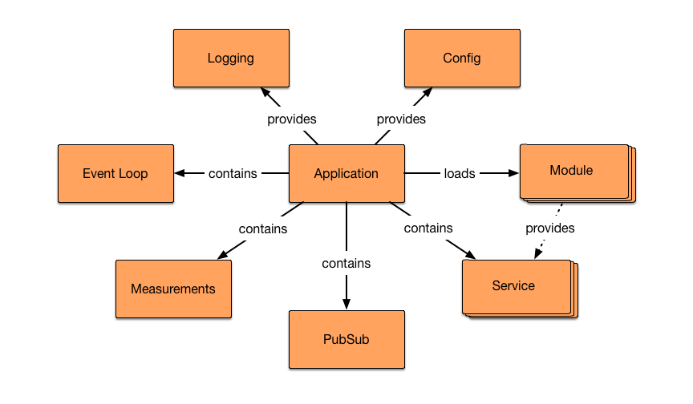

# Asynchronous Server Application Boilerplate

Asynchronous Server App Boilerplate (or _ASAB_ for short) minimizes the amount of code that needs to be written when building a server application in Python.
ASAB is fully asynchronous, this means you can use the new shiny async/await syntax from Python 3.5, making your code non-blocking, speedy and hence scalable.

We hope you will find _ASAB_ fun and easy to use, especially when you are about to build a Python-based application server such as web server, MQTT server, microservice container, ETL or stream processor.

ASAB is developed on [GitHub](https://github.com/TeskaLabs/asab).
Contributions are welcome.

Have fun!


## The simplest application

```python
#!/usr/bin/env python3
import asab
	
class MyApplication(asab.Application):
    async def main(self):
        print("Hello world!")
        self.stop()
	
if __name__ == '__main__':
    app = MyApplication()
    app.run()
```


## Principles

 * Write once, use many times
 * Keep it simple
 * Well documented
 * Asynchronous via Python 3.5+ `async`/`await` and `asyncio`
 * [Event-driven Architecture](https://en.wikipedia.org/wiki/Event-driven_architecture) / [Reactor pattern](https://en.wikipedia.org/wiki/Reactor_pattern)
 * Single-threaded core but compatible with threads
 * Compatible with [pypy](http://pypy.org), Just-In-Time compiler capable of boosting Python code performace more then 5x times
 * Support for introspection
 * Modularized


## High-level architecture


